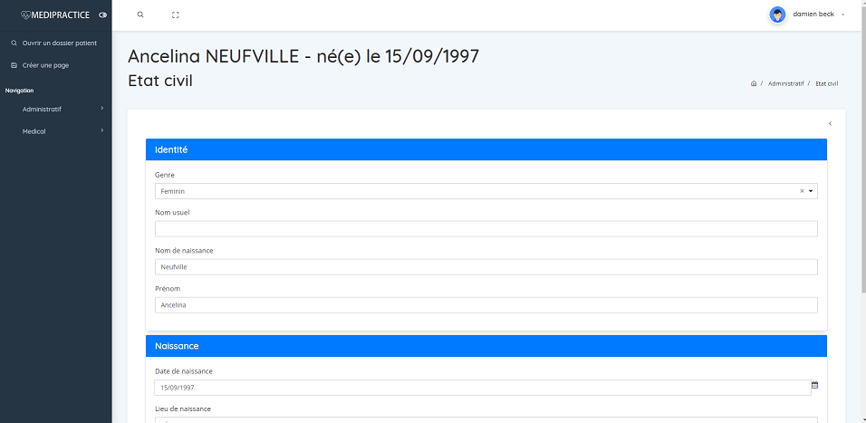

# Medipractice

Medipractice est une application de géstion de données patient.
Sa grande force est la possibilité de modifier dynamiquement toutes les pages et de créer des formulaires, en fonction des besoins des praticiens.

## Prérequis
Pour fonctionner, Medipractice demande au minimum l'environement suivant :

- Java 8
- Maven 3
- PostgreSQL 10 
- Redis 4

Le projet peut facielement être compilé en locale via la commande `mvn package`.

## Démarrer des services localement
Chaque microservice est une application Spring Boot et peut être démarré localement à l'aide de l'IDE ou de la commande `mvn spring-boot:run`. 
Veuillez noter que les services de support (config-server et discovery-server) doivent imperativement être démarrés avant tout autre service.

Si tout se passe bien, vous pouvez accéder aux services suivants:
* config-server     - http://localhost:19101 - Service de configuration
* discovery-server  - http://localhost:19102 - Service Eureka
* auth-server       - http://localhost:19111 - Service d'authentification OAuth2
* datafile-service  - http://localhost:19112 - Gestion des données patient
* page-service      - http://localhost:19113 - Gestion des pages et formulaires
* gateway-server    - http://localhost:9090 - Service ZUUL
* clientui          - http://localhost:8080 - Interface client

## Démarrer les services via Docker
Il est possible de lancer les services dans Docker
Pour cela, il faut d'abord creer les images par la commande `mvn clean package spring-boot:repackage install -DskipTests`
Un fois la compilation et la création des images finie, lancer les services via `docker-compose up`

## Comprendre l'application Spring Petclinic

Une fois démarré, vous pouvez accéder à Medipractice ici: http://localhost:8080

Le login et le mot de passe par default est : admin / admin

## Configuration de la base de données

Par défaut, les tables de la base de donnée sont générées au demarrage de l'application, et un jeu de donénes de démo est utilisé

